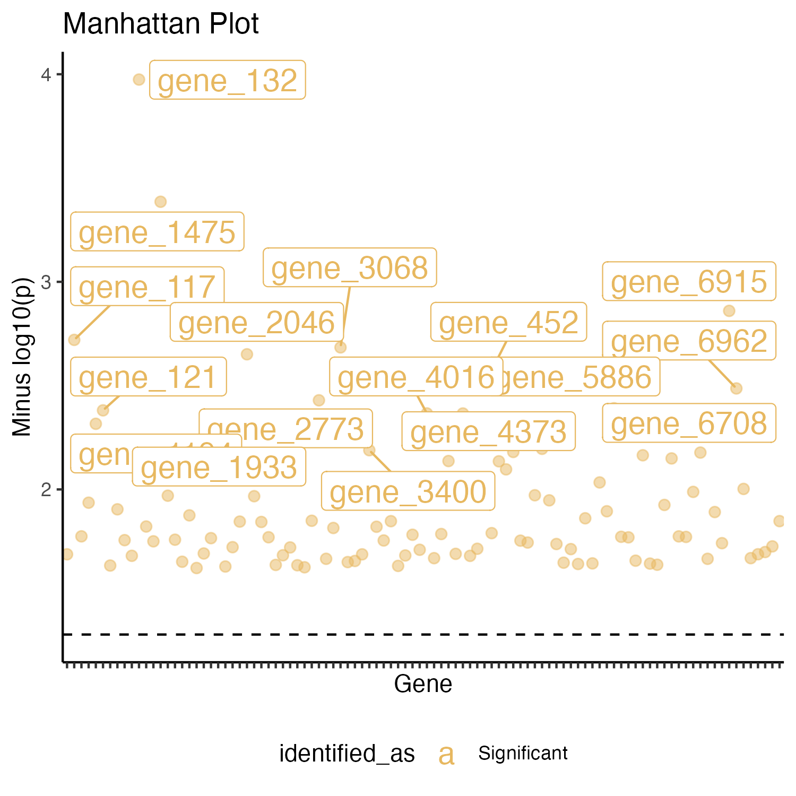
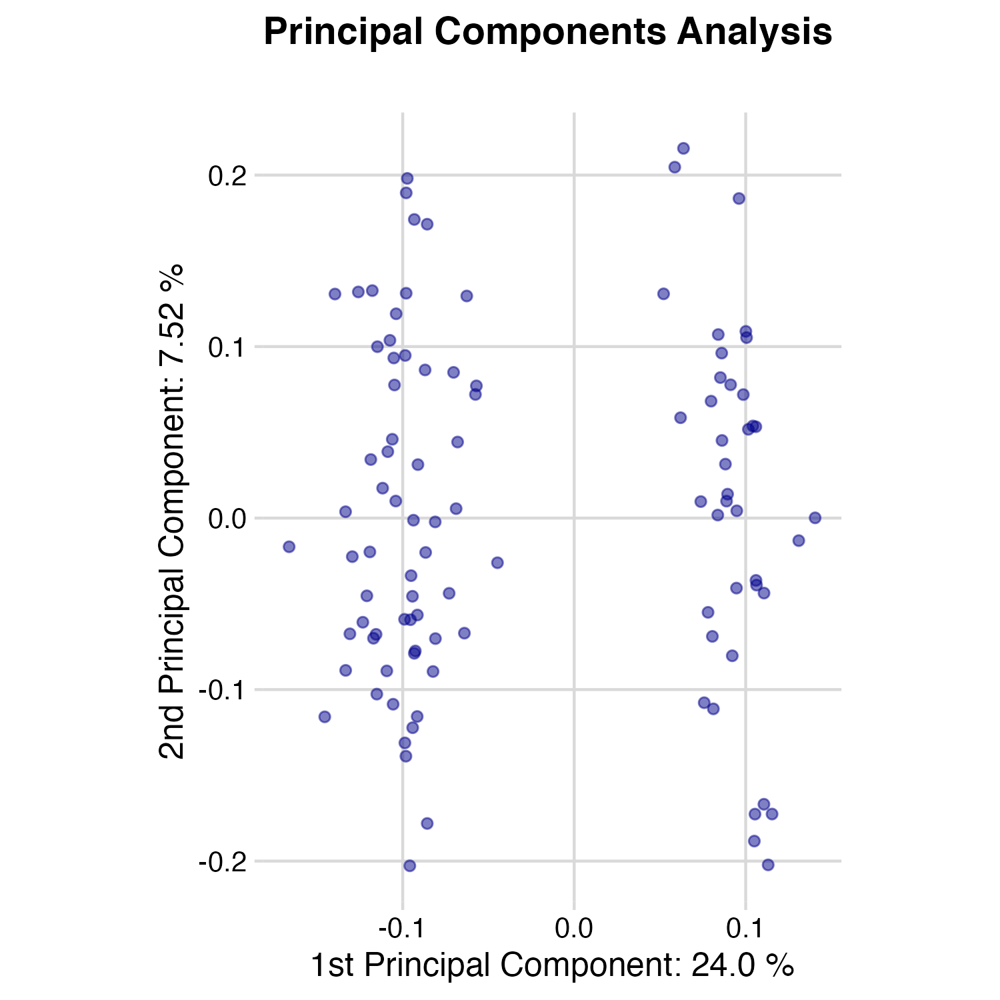
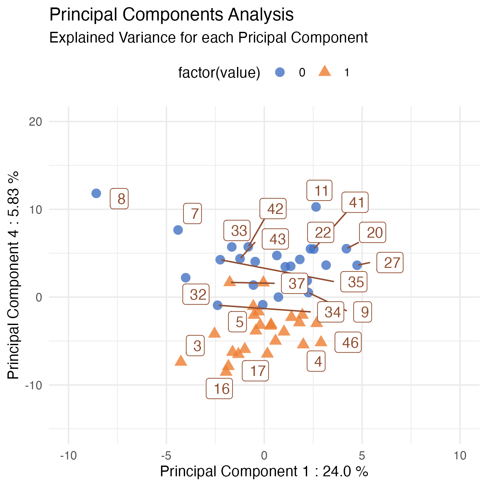
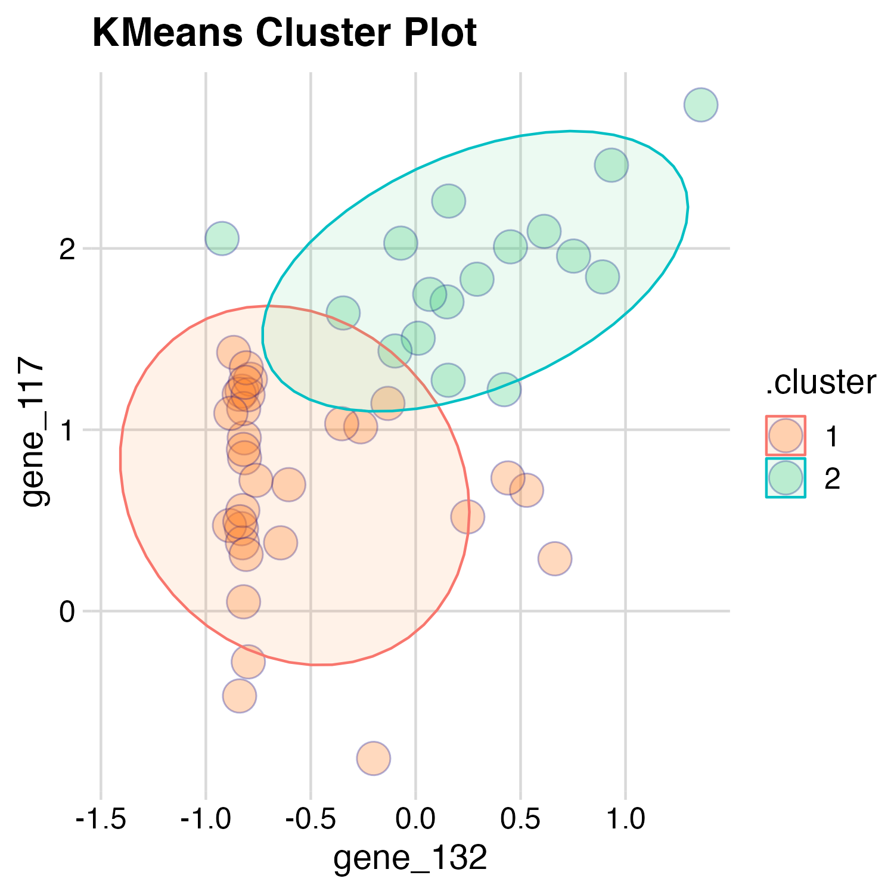

### Group Number 20

slidy_presentation: default
Note: ioslides_presentation not working, only slidy_presentation working at the moment. 
*html_document ioslides_presentation. 10 slides in 10 minutes.

***

### Introduction

The data chosen came from a research paper called: 'Predicting the clinical status of human breast cancer by using gene expression profiles'

This paper was written by Mike West, Carrie Blanchette, Holly Dressman et al. 

Neoplastic diseases are ones which cause tumours to grow in the body.

Gene expression assays come from DNA microarray analysis of breast cancer samples. 

The paper explains that Breast cancer tumours can be classified based on "eostregen receptor status".

The Breast cancer tumour samples were classidied based on the "eostregen receptor status".

In total, 49 tumours were classified as eostregen receptor positive or eostregen receptor negative. 

Note, the gene expression data is based on the eostregen receptor genes. 

***

This information may be given to doctors in order to help them make better clinical decisions when treating patients. 

The aim in this project is to communicate insights, explain why I decided on a particular pathway in the analysis, amd to reproduce results from the data used in this research paper. 

Raw data was processed during the data analysis in order to start the initial steps of overcoming challenging problems in coding. 

Decisions were made with regards to data processing and the reasons for these decisions are mentioned below. 

***

### Materials and Methods

The data used was microarray data contained in an .RData file in the following Github repository: https://github.com/ramhiser/datamicroarray/blob/master/data/west.RData

The R code was separated into six scripts and the HPC Cluster format outlined in the instructions was implemented. This bio data set required loading, cleaning and tidying, augmenting, modelling and visualisation.  

The process of arriving at results in a reproducible manner was important, especially was the scripts were run several times after changes were made. The code in the scripts was refined by the use of functions. The functions were created to aid reproducibility. These functions were evetually bundled up into a package. 

***

**Flow chart of the data journey**

{width=75%}

***

Over thirteen packages were used to aid in this analysis pipeline, including packages in the tidyverse, golem, reactable and packages for styling the code such as the stylr package. 

The statistical methods used in the research paper included binary regression models, singular value decompositions and stochastic regularization using Bayesian Analysis. 

The estimated vector was important for scoring genes in regards to their contribution to the classification. 

It is mentioned in the research paper that arrays were screened in order to find the first 100 genes that correlated the most with outcome, to reduce the noise produced by genes that were not expressed. 

The modelling methods used were principal components analysis, K-Means clustering and logistic regression. 

***

### Results

The  data was processed several in stages. 

During the first round of analysis, the unexpressed genes were not filtered out of my initial analysis.

I was yet to perform a thorough comparison with the statistical methods used in the research paper. 

{width=45%} {width=45%} 

There was a lot of noise due to genes that were not significantly expressed being included in the analysis. 
The analysis was run again once these genes had been filtered out.

{width=45%} {width=45%} 

In the research paper, the researchers performed a pairwise factor analysis of 100 genes based on lymph node status.(**left**)

In comparison with the research paper, the Principal Component Analysis visualisation I created was slightly improved in terms of the colour scheme chosen and the size of the points.(**right**)

{width=45%} {width=45%}

PCA, an unsupervised learning method which finds patterns in the data was used, because it simplifies the complexity in high-dimensional datasets by transforming the data into fewer dimensions.
These fewer dimensions, or principal components act as summaries of the features.

Results for PCA and K-means clustering were produced using ggplot2 and ggthemes packages. 

k-means clustering is an unsupervised machine learning algorithm which aims to partition a certian number of observations into k (assigned) clusters in which each observation belongs to the cluster with the nearest mean (cluster centers or cluster centroid).

{width=45%} {width=45%}

In addition to this Github repository and the presentation, I created a package called `Twenty`. The package was named after the group number allocated in the R for Bio Data Science class. This package is available for download from the Github repository at the following link: https://github.com/rforbiodatascience22/Twenty. The package contains four functions and example subset datasets to be used for each function. 

I also produced a Shiny Application called `ShinyTwenty`. This application can be found at the Github repository: https://github.com/rforbiodatascience22/ShinyTwenty. The application shows rendered interactive plots and visualisations of the data.

***

### Discussion 

It was computationally intensive to perform the modelling part of the analysis given there were 7130 features and 49 observations of data. Because of this computational expense I had challenges in finding a workaround to deploy the application online. 

***

